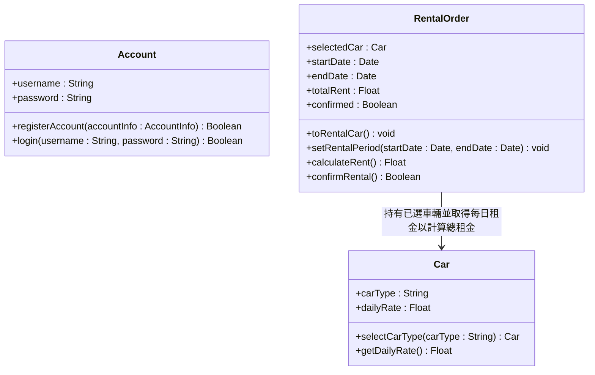

# CD_01 車輛租用系統 — Class Diagram

---

## 補充說明

| Class 名稱 | 中文名稱 | 職責說明 |
|------------|----------|----------|
| Account | 帳戶 | 負責租車用戶的帳戶註冊（RegisterAccount）與登入驗證（Login） |
| RentalOrder | 租車訂單 | 預約租車流程的核心類別，負責啟動租車（ToRentalCar）、設定租用時間區間、計算租金與確認租車 |
| Car | 車輛 | 代表可租用的車輛，提供車型選擇（SelectCarType）與每日租金查詢（GetDailyRate） |
