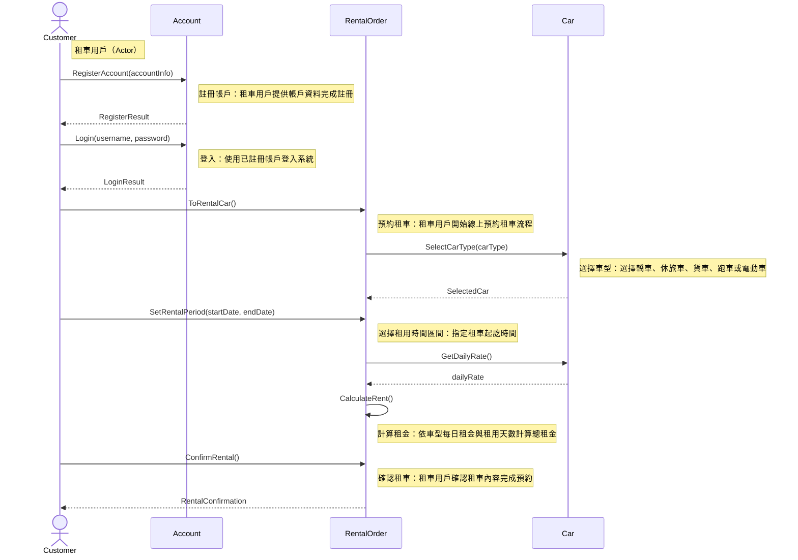

# SD_01 車輛租用系統

```mermaid
sequenceDiagram
    actor Customer
    participant Account
    participant RentalOrder
    participant Car

    Note right of Customer: 租車用戶（Actor）

    Customer->>Account: RegisterAccount(accountInfo)
    Note right of Account: 註冊帳戶：租車用戶提供帳戶資料完成註冊
    Account-->>Customer: RegisterResult

    Customer->>Account: Login(username, password)
    Note right of Account: 登入：使用已註冊帳戶登入系統
    Account-->>Customer: LoginResult

    Customer->>RentalOrder: ToRentalCar()
    Note right of RentalOrder: 預約租車：租車用戶開始線上預約租車流程

    RentalOrder->>Car: SelectCarType(carType)
    Note right of Car: 選擇車型：選擇轎車、休旅車、貨車、跑車或電動車
    Car-->>RentalOrder: SelectedCar

    Customer->>RentalOrder: SetRentalPeriod(startDate, endDate)
    Note right of RentalOrder: 選擇租用時間區間：指定租車起訖時間

    RentalOrder->>Car: GetDailyRate()
    Car-->>RentalOrder: dailyRate
    RentalOrder->>RentalOrder: CalculateRent()
    Note right of RentalOrder: 計算租金：依車型每日租金與租用天數計算總租金

    Customer->>RentalOrder: ConfirmRental()
    Note right of RentalOrder: 確認租車：租車用戶確認租車內容完成預約
    RentalOrder-->>Customer: RentalConfirmation
```
