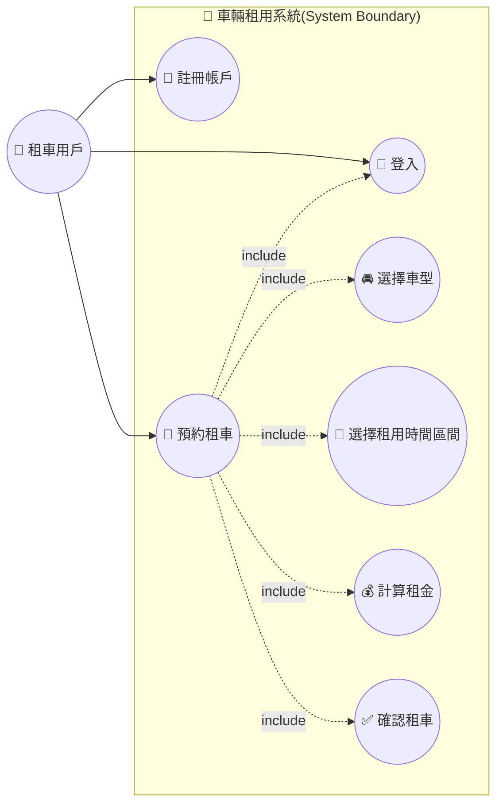

# UC_01 車輛租用系統

## Use Case 說明

- **Actor：租車用戶**
  在線上租車系統中，透過帳戶進行預約租車操作的使用者。

- **UC1 註冊帳戶**
  租車用戶在首次使用系統時，須先註冊自己的帳戶資料，才能取得登入與後續租車的權限。

- **UC2 登入**
  租車用戶使用已註冊的帳戶資料登入系統，登入成功後才可進行預約租車。

- **UC3 預約租車**
  租車用戶在線上預約租用車輛的主要使用案例，須先完成登入，並包含選擇車型、選擇租用時間區間、計算租金、確認租車等 4 個子步驟。

- **UC4 選擇車型（include by 預約租車）**
  租車用戶於預約流程中選擇欲租用的車輛車型。

- **UC5 選擇租用時間區間（include by 預約租車）**
  租車用戶於預約流程中指定租車的起訖時間區間。

- **UC6 計算租金（include by 預約租車）**
  系統依據所選車型與租用時間區間，計算應付租金。

- **UC7 確認租車（include by 預約租車）**
  租車用戶確認租車內容與租金後，完成租車預約。
